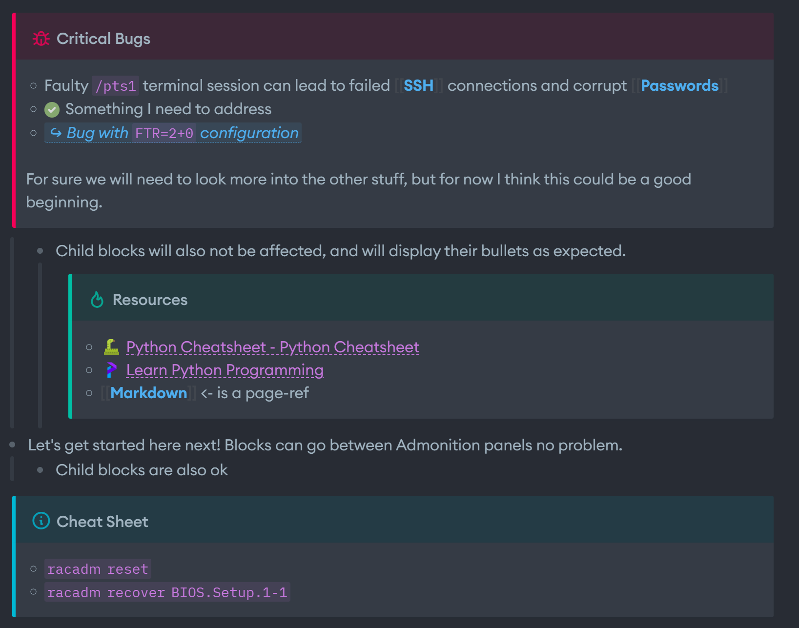

# Admonition Panels

adds admonition panels to Logseq.

  


# Installation

From the market place, you can navigate to Plugins > Search "Admonition Panels" > Install.

# Usage

Panels will be registered to slash commands and will start with the word "Admon - " ... You can configure Admonition panels in two ways.. The first is storing all your content in the parent block, and the alternative is to use child blocks.

Approach 1:
```markdown
- #admon-warning Warning!
  Nested data goes here..
```

Approach 2:
```markdown
- #admon-warning Warning!
  - Nested data goes here..
```